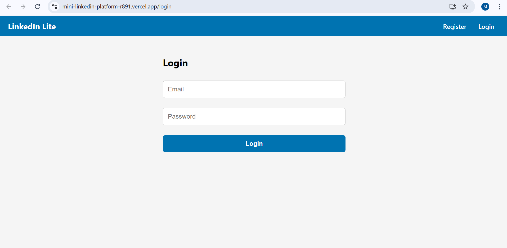
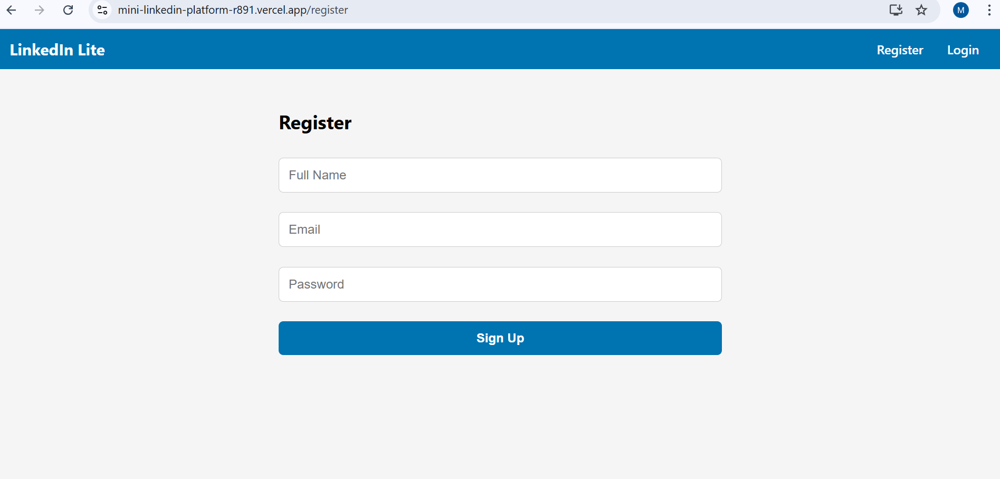
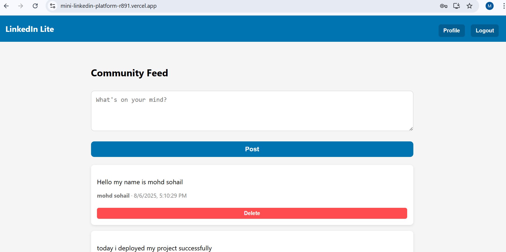
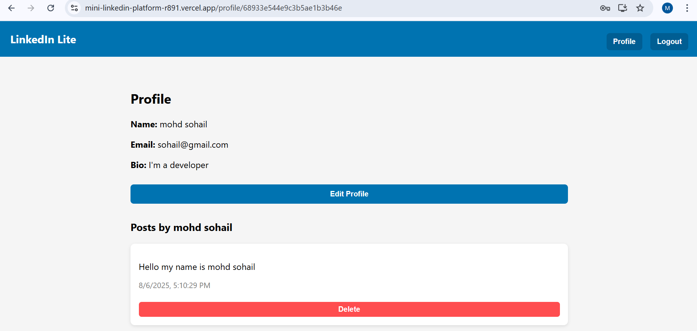

# 🌐 LinkedIn Community Platform

A mini LinkedIn-like full-stack web application built with **React**, **Node.js**, **Express**, and **MongoDB**.  
Users can **register, log in, create posts, view a feed, and manage their profile**.

---

## 🚀 Live Demo & Repo Links

- **Live Demo**: [Mini LinkedIn Platform](https://mini-linkedin-platform-r891.vercel.app/login)  
- **Repository**: [GitHub Repo](https://github.com/Mohdsohail7/mini-linkedin-platform)

---

## 🧰 Tech Stack

### Frontend:
- ⚛️ React.js  
- 🛣️ React Router DOM  
- 📡 Axios  
- 🔔 React Toastify (for notifications)

### Backend:
- 🟢 Node.js  
- 🚀 Express.js  
- 🍃 MongoDB Atlas  
- 🔑 JWT (JSON Web Token) for authentication  
- 🔒 Bcrypt for password hashing  
- 🌍 CORS  

---

## 🛠️ Setup Instructions

### 1. Clone the Repository
```bash
git clone https://github.com/Mohdsohail7/mini-linkedin-platform.git
cd mini-linkedin-platform
```

### 2. Install Dependencies
```bash
npm install
```

### 3. Start the Project
```bash
npm start
```

### 🖼️ screenshots
### 🔐 Login Page


### 🔐 Registration Page


### 🏠 Dashboard / Feed


### 👤 Profile Page

